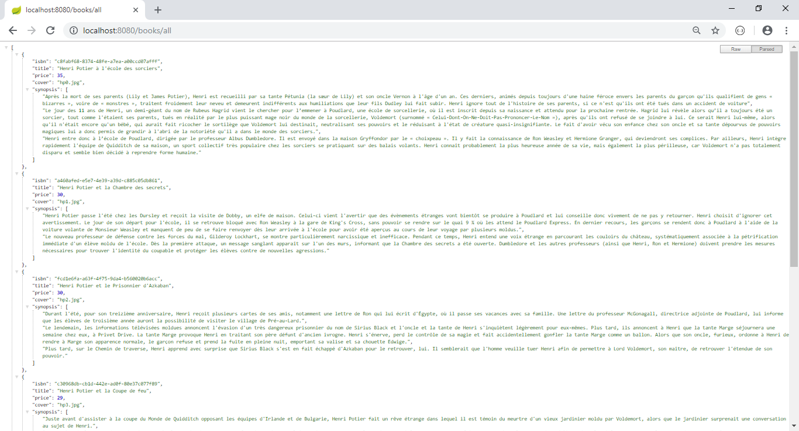
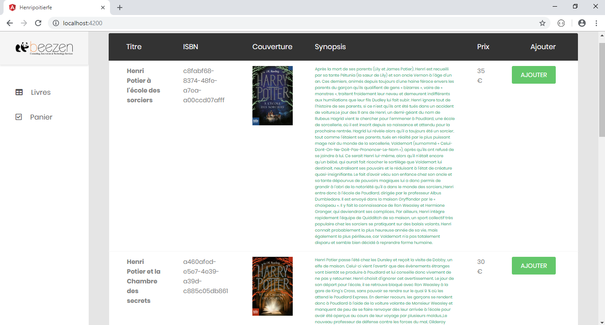
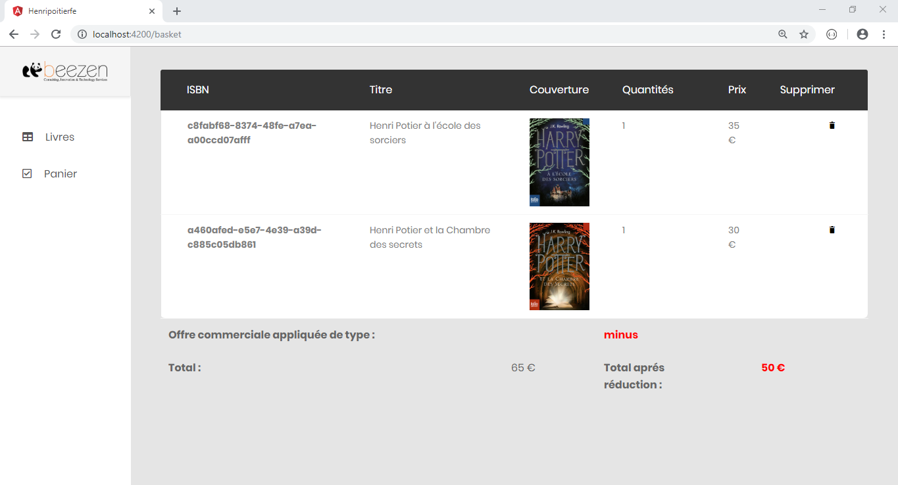
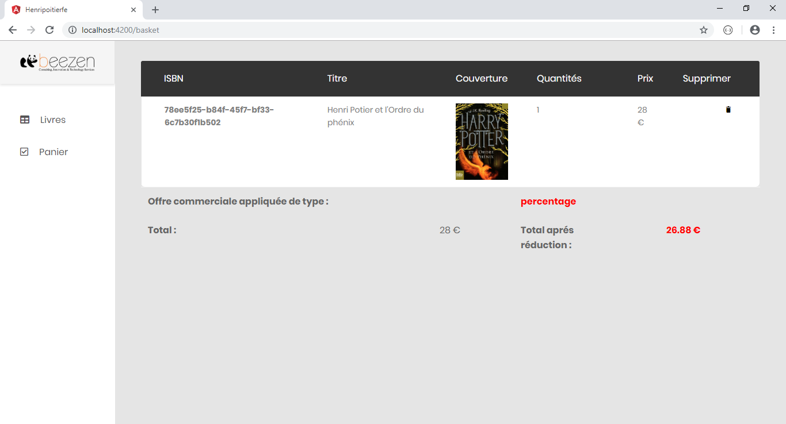
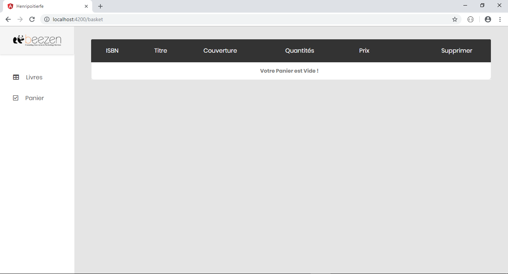

# Henri-Potier-Beezen
Application "La bibliothèque d’Henri Potier", Back-End (Spring Boot), Front-End (Angular 6)

<h4>Partie Back-End : /henripoitierbe  </h4>
<h4>Partie Front-End : /henripoitierfe </h4>
<h4>Fichier SQL pour installer la base de données : /BD/henripoitier.sql </h4>
 

<h2>Quelques explications :</h2>

 Dés le lancement du projet ( http://localhost:4200/ ) la première interface est affichée, et la requête ( http://localhost:8080/books/all ) fera appel en GET au service qui nous renverra la liste des livres sous le format JSON. 

 
 

Dès qu’un livre est ajouté au panier une suite de séquence est exécuter, chaque exemple dépend du nombre de livre ajouté au panier :

<h4>Exemple 1 :</h4>

Pour un seul livre (à 35€) la requête ( http://localhost:8080/offers/getone?id=percentage ) fera appel en GET au service qui nous renverra l’offre de type « percentage » applicable à ce panier sous le format JSON :
 {"offers":{"type":"percentage","value":4}} 

L’offre de réduction de type « percentage » sera appliqué à ce prix (35 €) et on obtiendra un nouveau prix après réduction (33.6 €).

<h4>Exemple 2 :</h4>

Pour deux livres (à 35€ et 30€) la requête ( http://localhost:8080/offers/all ) fera appel en GET au service qui nous renverra les offres applicables à ce panier sous le format JSON : {"offers":[{"type":"percentage","value":4},{"type":"minus","value":15},{"type":"slice","value":12,"sliceValue":100}]} 

La meilleure offre de réduction applicable à ce prix (65 €) est l’offre de type « minus » et on obtiendra un nouveau prix après réduction (50 €).

<h4>Exemple 3 :</h4>

Pour cinq livres (à 35€, 30€, 30€, 29€ et 28€) la requête ( http://localhost:8080/offers/all ) fera appel en GET au service qui nous renverra les offres applicables à ce panier sous le format JSON : {"offers":[{"type":"percentage","value":4},{"type":"minus","value":15},{"type":"slice","value":12,"sliceValue":100}]} 

La meilleure offre de réduction applicable à ce prix (152 €) est l’offre de type « slice » et on obtiendra un nouveau prix après réduction (133.76 €).

<h2>Développement :</h2>
  
	Partie BackEnd développée avec le framework Spring Boot 

  
	Partie FrontEnd développée avec le framework Angular 6  
 
  
==>	<b>Lancement du projet avec la commande</b> : run npm install run ng s --o 

  
==>	<b>Nom de la base de données MySQL</b> : henripoitier  <b>Username</b>: root  <b>Password:</b> 

<h2> Les deux Interfaces :</h2>
 
<h5>L’interface principale (Liste des livres) : adresse ( http://localhost:4200/ )</h5> 
  
<h5>L’interface du panier : adresse ( http://localhost:4200/basket )</h5>
  
 
 
 
<h5>Autres captures de l'interface du Panier</h5>
 
 

 
 

